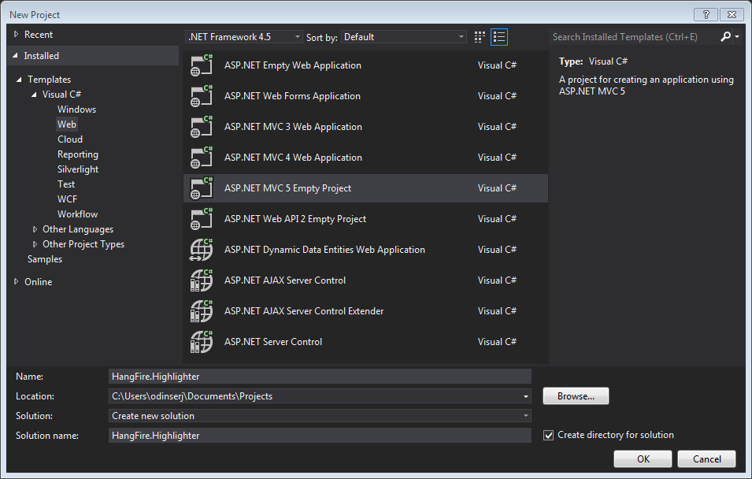
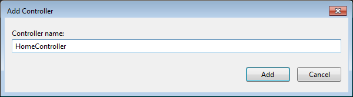
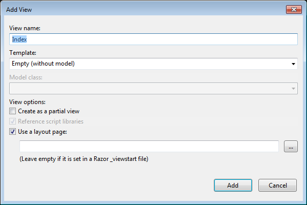
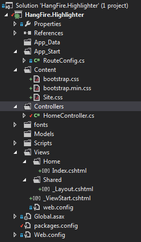
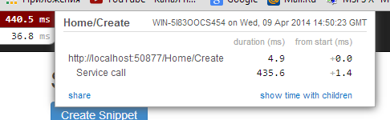
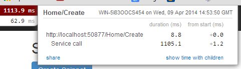
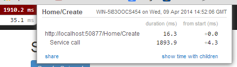
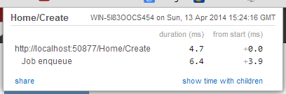

Code Syntax Highlighting
=========================

====================== =======
Simple sample          https://github.com/odinserj/HangFire.Highlighter 
Full sample            http://highlighter.hangfire.io, `sources <https://github.com/odinserj/HangFire/tree/master/samples/HangFire.Sample.Highlighter>`_
====================== =======

.. contents:: Table of Contents
   :local:
   :depth: 2

Overview
---------

Let's start with a simple example. Consider you are building a code snippet gallery web application like `GitHub Gists <http://gist.github.com>`_, and want to implement the syntax highlighting feature. To improve user experience, you are also want it to work even if a user disabled JavaScript in her browser.

To support this scenario and to reduce the project development time, you choosed to use a web service for syntax highlighting, such as http://pygments.appspot.com or http://www.hilite.me.

.. note::

   Although this feature can be implemented without web services (using different syntax highlighter libraries for .NET), we are using them just to show some pitfalls regarding to their usage in web applications.

   You can substitute this example with real-world scenario, like using external SMTP server, another services or even long-running CPU-intensive task.

Setting up the project
-----------------------

.. tip::

   This section contains steps to prepare the project. However, if you don't want to do the boring stuff or if you have problems with project set-up, you can clone the `tutorial repository <https://github.com/odinserj/HangFire.Highlighter/tree/before>`_ (its ``before``  branch) and go straight to :ref:`the-problem` section.

Prerequisites
^^^^^^^^^^^^^^

The tutorial uses **Visual Studio 2012** with `Web Tools 2013 for Visual Studio 2012 <http://www.asp.net/visual-studio/overview/2012/aspnet-and-web-tools-20131-for-visual-studio-2012>`_ installed, but it can be built either with Visual Studio 2013.

The project uses **.NET 4.5**, **ASP.NET MVC 5** and **SQL Server 2008 Express** or later database.

Creating a project
^^^^^^^^^^^^^^^^^^^

Let's start from scratch. Create an *ASP.NET MVC 5 Empty Project* and name this awesome web application ``HangFire.Highlighter`` (you can name it as you want, but prepare to change namespaces).

I've included some screenshots to make the project set-up not so boring:

Then, we need a controller to handle web requests. So scaffold an **MVC 5 Controller - Empty** controller and call it ``HomeController``:

Our controller contains now only ``Index`` action and looks like:

.. code-block:: c#

   public class HomeController : Controller
   {
       public ActionResult Index()
       {
           return View();
       }
   }

We have a controller with a single action. To test that our application is working, scaffold an **empty view** for ``Index`` action.

The view scaffolding process also adds additional components to the project, like *Bootstrap*, *jQuery*, etc. After these steps my solution looks like:

Let's test the initial setup of our application. Press the :kbd:`F5` key to start debugging and wait for your browser. If you encounter exceptions or don't see the default page, try to reproduce all the given steps, see the `tutorial sources <https://github.com/odinserj/HangFire.Highlighter>`_ or ask a question in the comments below.

Defining a model
~~~~~~~~~~~~~~~~

We should use a persistent storage to preserve snippets after application restarts. So, we'll use **SQL Server 2008 Express** (or later) as a relational storage, and **Entity Framework** to access the data of our application.

Installing Entity Framework
++++++++++++++++++++++++++++

Open the `Package Manager Console <https://docs.nuget.org/docs/start-here/using-the-package-manager-console>`_ window and type:

.. code-block:: powershell

   Install-Package EntityFramework

After the package installed, create a new class in the ``Models`` folder and name it ``HighlighterDbContext``:

.. code-block:: c#

   // ~/Models/HighlighterDbContext.cs

   using System.Data.Entity;

   namespace HangFire.Highlighter.Models
   {
       public class HighlighterDbContext : DbContext
       {
           public HighlighterDbContext() : base("HighlighterDb")
           {
           }
       }
   }

Please note, that we are using undefined yet connection string name ``HighlighterDb``. So, lets add it to the ``web.config`` file just after the ``</configSections>`` tag:

.. code-block:: xml

   <connectionStrings>
     <add name="HighlighterDb" connectionString="Server=.\sqlexpress; Database=HangFire.Highlighter; Trusted_Connection=True;" providerName="System.Data.SqlClient" />
   </connectionStrings>

Then enable **Entity Framework Code First Migrations** by typing in your *Package Manager Console* window the following command:

.. code-block:: powershell

   Enable-Migrations

Adding code snippet model
++++++++++++++++++++++++++

It's time to add the most valuable class in the application. Create the ``CodeSnippet`` class in the ``Models`` folder with the following code:

.. code-block:: c#

   // ~/Models/CodeSnippet.cs

   using System;
   using System.ComponentModel.DataAnnotations;
   using System.Web.Mvc;

   namespace HangFire.Highlighter.Models
   {
       public class CodeSnippet
       {
           public int Id { get; set; }

           [Required, AllowHtml, Display(Name = "C# source")]
           public string SourceCode { get; set; }
           public string HighlightedCode { get; set; }

           public DateTime CreatedAt { get; set; }
           public DateTime? HighlightedAt { get; set; }
       }
   }

Don't forget to include the following property in the ``HighlighterDbContext`` class:

.. code-block:: c#

   // ~/Models/HighlighterDbContext.cs
   public DbSet<CodeSnippet> CodeSnippets { get; set; }

Then add a database migration and run it by typing the following commands into the Package Manager Console window:

.. code-block:: powershell

   Add-Migration AddCodeSnippet
   Update-Database

Our database is ready to use!

Creating actions and views
~~~~~~~~~~~~~~~~~~~~~~~~~~~

Now its time to breathe life into our project. Please, modify the following files as described.

.. code-block:: c#

  // ~/Controllers/HomeController.cs

  using System;
  using System.Linq;
  using System.Web.Mvc;
  using HangFire.Highlighter.Models;

  namespace HangFire.Highlighter.Controllers
  {
      public class HomeController : Controller
      {
          private readonly HighlighterDbContext _db = new HighlighterDbContext();

          public ActionResult Index()
          {
              return View(_db.CodeSnippets.ToList());
          }

          public ActionResult Details(int id)
          {
              var snippet = _db.CodeSnippets.Find(id);
              return View(snippet);
          }

          public ActionResult Create()
          {
              return View();
          }

          [HttpPost]
          public ActionResult Create([Bind(Include="SourceCode")] CodeSnippet snippet)
          {
              if (ModelState.IsValid)
              {
                  snippet.CreatedAt = DateTime.UtcNow;
                   
                  // We'll add the highlighting a bit later.

                  _db.CodeSnippets.Add(snippet);
                  _db.SaveChanges();

                  return RedirectToAction("Details", new { id = snippet.Id });
              }

              return View(snippet);
          }

          protected override void Dispose(bool disposing)
          {
              if (disposing)
              {
                  _db.Dispose();
              }
              base.Dispose(disposing);
          }
      }
  }

.. code-block:: html

  @* ~/Views/Index.cshtml *@

  @model IEnumerable<HangFire.Highlighter.Models.CodeSnippet>
  @{ ViewBag.Title = "Snippets"; }

  <h2>Snippets</h2>

  
<a class="btn btn-primary" href="@Url.Action("Create")">Create Snippet</a>

  <table class="table">
      <tr>
          <th>Code</th>
          <th>Created At</th>
          <th>Highlighted At</th>
      </tr>

      @foreach (var item in Model)
      {
          <tr>
              <td>
                  <a href="@Url.Action("Details", new { id = item.Id })">@Html.Raw(item.HighlightedCode)</a>
              </td>
              <td>@item.CreatedAt</td>
              <td>@item.HighlightedAt</td>
          </tr>
       }
  </table>

.. code-block:: html

  @* ~/Views/Create.cshtml *@

  @model HangFire.Highlighter.Models.CodeSnippet
  @{ ViewBag.Title = "Create a snippet"; }

  <h2>Create a snippet</h2>

  @using (Html.BeginForm())
  {
      @Html.ValidationSummary(true)

      

          @Html.LabelFor(model => model.SourceCode)
          @Html.ValidationMessageFor(model => model.SourceCode)
          @Html.TextAreaFor(model => model.SourceCode, new { @class = "form-control", style = "min-height: 300px;", autofocus = "true" })
      

      <button type="submit" class="btn btn-primary">Create</button>
      <a class="btn btn-default" href="@Url.Action("Index")">Back to List</a>
  }

.. code-block:: html

  @* ~/Views/Details.cshtml *@

  @model HangFire.Highlighter.Models.CodeSnippet
  @{ ViewBag.Title = "Details"; }

  <h2>Snippet <small>#@Model.Id</small></h2>

  

      <dl class="dl-horizontal">
          <dt>@Html.DisplayNameFor(model => model.CreatedAt)</dt>
          <dd>@Html.DisplayFor(model => model.CreatedAt)</dd>
          <dt>@Html.DisplayNameFor(model => model.HighlightedAt)</dt>
          <dd>@Html.DisplayFor(model => model.HighlightedAt)</dd>
      </dl>
      
      

  

  
@Html.Raw(Model.HighlightedCode)

Adding MiniProfiler
~~~~~~~~~~~~~~~~~~~~

To not to profile our application by eye, we'll use the ``MiniProfiler`` package available on NuGet.

.. code-block:: c#

  Install-Package MiniProfiler

After installing, update the following files as described to enable profiling.

.. code-block:: c#

  // ~/Global.asax.cs

  public class MvcApplication : HttpApplication
  {
      /* ... */

      protected void Application_BeginRequest()
      {
          StackExchange.Profiling.MiniProfiler.Start();
      }

      protected void Application_EndRequest()
      {
          StackExchange.Profiling.MiniProfiler.Stop();
      }
  }

.. code-block:: html

  @* ~/Views/Shared/_Layout.cshtml *@

  <head>
    <!-- ... -->
    @StackExchange.Profiling.MiniProfiler.RenderIncludes()
  </head>

You should also include the following setting to the ``web.config`` file, if the ``runAllManagedModulesForAllRequests`` is set to ``false`` in your application (it is by default):

.. code-block:: xml

  <!-- ~/web.config -->

  <configuration>
    ...
    <system.webServer>
      ...
      <handlers>
        <add name="MiniProfiler" path="mini-profiler-resources/*" verb="*" type="System.Web.Routing.UrlRoutingModule" resourceType="Unspecified" preCondition="integratedMode" />
      </handlers>
    </system.webServer>
  </configuration>

Hiliting the code
^^^^^^^^^^^^^^^^^^

It is the core functionality of our application. We'll use the http://hilite.me service that provides HTTP API to perform highlighting work. To start to consume its API, install the ``Microsoft.Net.Http`` package:

.. code-block:: powershell

   Install-Package Microsoft.Net.Http

This library provides simple asynchronous API for sending HTTP requests and receiving HTTP responses. So, let's use it to make an HTTP request to the *hilite.me* service:

.. code-block:: c#

  // ~/Controllers/HomeController.cs

  /* ... */

  public class HomeController
  {
      /* ... */

      private static async Task<string> HighlightSourceAsync(string source)
      {
          using (var client = new HttpClient())
          {
              var response = await client.PostAsync(
                  @"http://hilite.me/api",
                  new FormUrlEncodedContent(new Dictionary<string, string>
                  {
                      { "lexer", "c#" },
                      { "style", "vs" },
                      { "code", source }
                  }));

              response.EnsureSuccessStatusCode();

              return await response.Content.ReadAsStringAsync();
          }
      }

      private static string HighlightSource(string source)
      {
          // Microsoft.Net.Http does not provide synchronous API,
          // so we are using wrapper to perform a sync call.
          return RunSync(() => HighlightSourceAsync(source));
      }

      private static TResult RunSync<TResult>(Func<Task<TResult>> func)
      {
          return Task.Run<Task<TResult>>(func).Unwrap().GetAwaiter().GetResult();
      }
  }

Then, call it inside the ``HomeController.Create`` method. 

.. code-block:: c#

  // ~/Controllers/HomeController.cs

  [HttpPost]
  public ActionResult Create([Bind(Include = "SourceCode")] CodeSnippet snippet)
  {
      try
      {
          if (ModelState.IsValid)
          {
              snippet.CreatedAt = DateTime.UtcNow;

              using (StackExchange.Profiling.MiniProfiler.StepStatic("Service call"))
              {
                  snippet.HighlightedCode = HighlightSource(snippet.SourceCode);
                  snippet.HighlightedAt = DateTime.UtcNow;
              }

              _db.CodeSnippets.Add(snippet);
              _db.SaveChanges();

              return RedirectToAction("Details", new { id = snippet.Id });
          }
      }
      catch (HttpRequestException)
      {
          ModelState.AddModelError("", "Highlighting service returned error. Try again later.");
      }

      return View(snippet);
  }

.. _async-note:

.. note::

  We are using synchronous controller action method, although it is recommended to use `asynchronous one <http://www.asp.net/mvc/tutorials/mvc-4/using-asynchronous-methods-in-aspnet-mvc-4>`_ to make network calls inside ASP.NET request handling logic. As written in the given article, asynchronous actions greatly increase application :abbr:`capacity (The maximum throughput a system can sustain, for a given workload, while maintaining an acceptable response time for each individual transaction. – from "Release It" book written by Michael T. Nygard)`, but does not help to increase :abbr:`performance (How fast the system processes a single transaction. – from "Release It" book written by Michael T. Nygard)`. You can test it by yourself with a `sample application <http://highlighter.hangfire.io>`_ – there are no differences in using sync or async actions with a single request.

  This sample is aimed to show you the problems related to application performance. And sync actions are used only to keep the tutorial simple.

.. _the-problem:

The problem
------------

.. tip::

  You can use the `hosted sample <http://highlighter.hangfire.io>`_ to see what's going on.

Now, when the application is ready, try to create some code snippets, starting from a smaller ones. Do you notice a small delay after you clicked the :guilabel:`Create` button?

On my development machine it took about 0.5s to redirect me to the details page. But let's look at *MiniProfiler* to see what is the cause of this delay:

As we see, call to web service is our main problem. But what happens when we try to create a medium code block?

And finally a large one:

The lag is increasing when we enlarge our code snippets. Moreover, consider that syntax highlighting web service (that is not under your control) experiences heavy load, or there are latency problems with network on their side. Or consider heavy CPU-intensive task instead of web service call that you can not optimize well. 

Your users will be annoyed with unresponsible application and inadequate delays.

Solving a problem
------------------

What can you do with a such problem? `Async controller actions <http://www.asp.net/mvc/tutorials/mvc-4/using-asynchronous-methods-in-aspnet-mvc-4>`_ will not help, as I said :ref:`earlier <async-note>`. You should somehow take out web service call and process it outside of a request, in the background. Here is some ways to do this:

* **Use recurring tasks** and scan un-highlighted snippets on some interval.
* **Use job queues**. Your application will enqueue a job, and some external worker threads will listen this queue for new jobs.

Ok, great. But there are several difficulties related to these techniques. The former requires us to set some check interval. Shorter interval can abuse our database, longer interval increases latency. 

The latter way solves this problem, but brings another ones. Should the queue be persistent? How many workers do you need? How to coordinate them? Where should they work, inside of ASP.NET application or outside, in Windows Service? The last question is the sore spot of long-running requests processing in ASP.NET application:

.. warning::

   **DO NOT** run long-running processes inside of your ASP.NET application, unless they are prepared to **die at any instruction** and there is mechanism that can re-run them.

   They will be simple aborted on application shutdown, and can be aborted even if the ``IRegisteredObject`` interface is being used due to time out.

Too many questions? Relax, you can use `HangFire <http://hangfire.io>`_. It is based on *persistent queues* to survive on application restarts, uses *reliable fetching* to handle unexpected thread aborts and contains *coordination logic* to allow multiple worker threads. And it is simple enough to use it.

.. note::

   **YOU CAN** process your long-running jobs with HangFire inside ASP.NET application – aborted jobs will be restarted automatically.

Installing HangFire
^^^^^^^^^^^^^^^^^^^^

To install HangFire, run the following command in the Package Manager Console window:

.. code-block:: powershell

   Install-Package HangFire

After the package installed, open the ``App_Start/HangFireConfig.cs`` file to change the database connection string:

.. code-block:: c#

   JobStorage.Current = new SqlServerStorage(System.Configuration.ConfigurationManager
       .ConnectionStrings["HighlighterDb"]
       .ConnectionString);

That's all. All database tables will be created automatically on first start-up.

Moving to background
^^^^^^^^^^^^^^^^^^^^^

First, we need to define our background job method that will be called when worker thread catches highlighting job. We'll simply define it as a static method inside the ``HomeController`` class with the ``snippetId`` parameter.

.. code-block:: c#

  // ~/Controllers/HomeController.cs

  /* ... Action methods ... */

  // Process a job
  public static void HighlightSnippet(int snippetId)
  {
      using (var db = new HighlighterDbContext())
      {
          var snippet = db.CodeSnippets.Find(snippetId);
          if (snippet == null) return;

          snippet.HighlightedCode = HighlightSource(snippet.SourceCode);
          snippet.HighlightedAt = DateTime.UtcNow;

          db.SaveChanges();
      }
  }

Note that it is simple method that does not contain any HangFire-related functionality. It creates a new instance of the ``HighlighterDbContext`` class, looks for the desired snippet and makes a call to a web service.

Then, we need to place the invocation of this method on a queue. So, let's modify the ``Create`` action:

.. code-block:: c#

  // ~/Controllers/HomeController.cs

  [HttpPost]
  public ActionResult Create([Bind(Include = "SourceCode")] CodeSnippet snippet)
  {
      if (ModelState.IsValid)
      {
          snippet.CreatedAt = DateTime.UtcNow;

          _db.CodeSnippets.Add(snippet);
          _db.SaveChanges();

          using (StackExchange.Profiling.MiniProfiler.StepStatic("Job enqueue"))
          {
              // Enqueue a job
              BackgroundJob.Enqueue(() => HighlightSnippet(snippet.Id));
          }

          return RedirectToAction("Details", new { id = snippet.Id });
      }

      return View(snippet);
  }

That's all. Try to create some snippets and see the timings (don't worry if you see an empty page, I'll cover it a bit later):

Good, 6ms vs ~2s. But there is another problem. Did you notice that sometimes you are being redirected to the page with no source code at all? This happens because our view contains the following line:

.. code-block:: html
  
   
@Html.Raw(Model.HighlightedCode)

Why the ``Model.HighlightedCode`` returns null instead of highlighted code? This happens because of **latency** of the background job invocation – there is some delay before a worker fetch the job and perform it. You can refresh the page and the highlighted code will appear on your screen.

But empty page can confuse a user. What to do? First, you should take this specific into a place. You can reduce the latency to a minimum, but **you can not avoid it**. So, your application should deal with this specific issue. 

In our example, we'll simply show the notification to a user and the un-highlighted code, if highlighted one is not available yet:

.. code-block:: html

  

      @if (Model.HighlightedCode == null)
      {
          

              <h4>Highlighted code is not available yet.</h4>
              
Don't worry, it will be highlighted even in case of a disaster 
                  (if we implement failover strategies for our job storage).

              
<a href="javascript:window.location.reload()">Reload the page</a> 
                  manually to ensure your code is highlighted.

          

          
          @Model.SourceCode
      }
      else
      {
          @Html.Raw(Model.HighlightedCode)
      }
  

But instead you could poll your application from a page using AJAX until it returns highlighted code:

.. code-block:: c#

   // ~/Controllers/HomeController.cs

   public ActionResult HighlightedCode(int snippetId)
   {
       var snippet = _db.Snippets.Find(snippetId);
       if (snippet.HighlightedCode == null)
       {
           return new HttpStatusCodeResult(HttpStatusCode.NoContent);
       }

       return Content(snippet.HighlightedCode);
   }

Or you can also use send a command to users via SignalR channel from your ``HighlightSnippet`` method. But that's another story.

Conclusion
-----------

In this tutorial you've seen that:

* Sometimes you can't avoid long-running methods in ASP.NET applications.
* Long running methods can cause your application to be un-responsible from the users point of view.
* To remove waits you should place your long-running method invocation into background job.
* Background job processing is complex itself, but simple with HangFire.

Please, ask any questions using the comments form below.