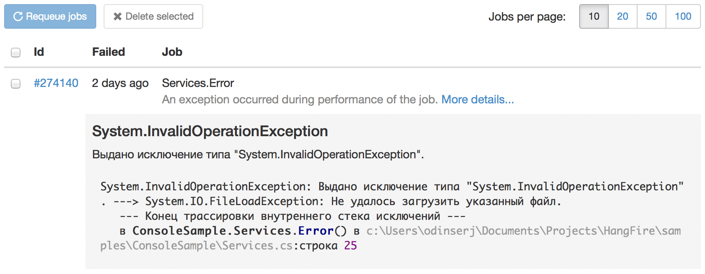

Dealing with exceptions
========================

Bad things happen. Every methods can throw exception of different types. These exceptions can be caused either by programming errors that require you to re-deploy the application, or transient errors, that can be fixed without additional deployment.

Hangfire handles all exceptions occured both in internal (belonging to Hangfire itself), and external methods (jobs, filters and so on), so it will not bring down the whole application. All internal exceptions are being logged (so, don't forget to :doc:`enable logging <../deployment-to-production/adding-logging>`) and the worst case they can lead – background processing will be stopped after ``10`` retry attempts with increasing delay modifier.

When Hangfire encounters external exception that occured during the job performance, it will automatically *try* to change its state to the ``Failed`` one, and you always can find this job in the Monitor UI (it will not be expired unless you delete it explicitly).

In the previous paragraph I said that Hangfire *will try* to change its state to failed, because state transition is one of places, where :doc:`job filters <../extensibility/using-job-filters>` can intercept and change the initial pipeline. And the ``AutomaticRetryAttribute`` class is one of them, that schedules the failed job to be automatically retried after increasing delay.

This filter is applied globally to all methods and have 10 retry attempts by default. So, your methods will be retried in case of exception automatically, and you receive warning log messages on every failed attempt. If retry attempts exceeded their maximum, the job will be move to the ``Failed`` state (with an error log message), and you will be able to retry it manually.

If you don't want a job to be retried, place an explicit attribute with 0 maximum retry attempts value:

.. code-block:: c#

   [AutomaticRetry(Attempts = 0)]
   public void BackgroundMethod()
   {   
   }

Use the same way to limit the number of attempts to the different value.