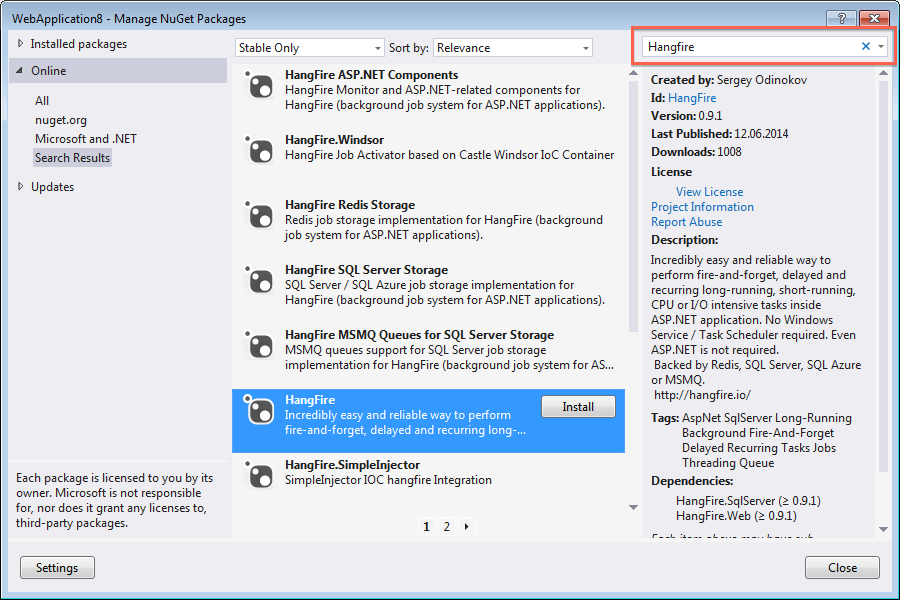

Installation
=============

Hangfire project consists of a couple of NuGet packages available on `NuGet Gallery site <https://www.nuget.org/packages?q=hangfire>`_. Here is the list of basic packages you should know about:

* `Hangfire <https://www.nuget.org/packages/HangFire/>`_ – bootstrapper package that is intended to be installed **only** for ASP.NET applications that uses SQL Server as a job storage. It simply references to `Hangfire.Core <https://www.nuget.org/packages/HangFire.Core/>`_, `Hangfire.SqlServer <https://www.nuget.org/packages/HangFire.SqlServer/>`_ and `Microsoft.Owin.Host.System.Web <https://www.nuget.org/packages/Microsoft.Owin.Host.SystemWeb/>`_ packages.
* `Hangfire.Core <https://www.nuget.org/packages/HangFire.Core/1.0.0-alpha1>`_ – basic package that contains all core components of Hangfire. It can be used in any project type, including ASP.NET application, Windows Service, Console, any OWIN-compatible web application, Azure Worker Role, etc.

Using Package Manager Console
------------------------------

.. code-block:: c#

   PM> Install-Package HangFire

Using NuGet Package Manager
----------------------------

Right-click on your project in Visual Studio and choose the ``Manage NuGet Packages`` menu item. Search for ``Hangfire`` and install the choosed package:

