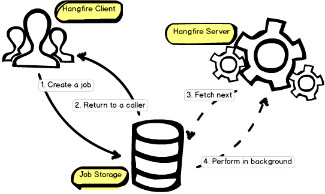

Overview
=========

Hangfire allows you to kick off method calls outside of the request processing pipeline in a very easy, but reliable way. These method invocations are being performed in a *background thread* and called *background jobs*.

From the 10.000-feet view the library consist of three main components: *client*, *storage* and *server*. Here is a small diagram that describes the main processes in Hangfire:

Client
-------

You can create any kind of background jobs using Hangfire: :doc:`fire-and-forget <../background-methods/calling-methods-in-background>` (to offload the method invocation), :doc:`delayed <../background-methods/calling-methods-with-delay>` (to perform the call after some time) and :doc:`recurring <../background-methods/performing-recurrent-tasks>` (to perform methods hourly, daily and so on).

Hangfire does not require you to create special classes. Background jobs are based on regular static or instance methods invocation. 

.. code-block:: c#

   var client = new BackgroundJobClient();

   client.Enqueue(() => Console.WriteLine("Easy!"));
   client.Delay(() => Console.WriteLine("Reliable!"), TimeSpan.FromDays(1));

There is also more easy way to create background jobs – the ``BackgroundJob`` class that allows you to use static methods to perform the creation task.

.. code-block:: c#

   BackgroundJob.Enqueue(() => Console.WriteLine("Hello!"));

The control is being returned to a caller just after Hangfire serializes the given information and saves it to the *storage*.

Job Storage
------------

Hangfire keeps background jobs and other information that relates to the processing inside a *persistent storage*. Persistence helps background jobs to **survive on application restarts**, server reboots, etc. This is the main distinction between performing background jobs using *CLR's Thread Pool* and *Hangfire*. Different storage backends are supported:

* :doc:`SQL Azure, SQL Server 2008 R2 <../storage-configuration/using-sql-server>` (and later of any edition, including Express)
* :doc:`Redis <../storage-configuration/using-redis>`

SQL Server storage can be empowered with :doc:`MSMQ <../storage-configuration/using-sql-server-with-msmq>` or RabbitMQ to lower the processing latency.

.. code-block:: c#

   JobStorage.Current = new SqlServerStorage("db_connection");

Server
-------

Background jobs are being processed by :doc:`Hangfire Server <../background-processing/processing-background-jobs>`. It is implemented as a set of dedicated (not thread pool's) background threads that fetch jobs from a storage and process them. Server is also responsible to keep the storage clean and remove old data automatically.

All you need is to create an instance of the ``BackgroundJobServer`` class and start the processing:

.. code-block:: c#

   var server = new BackgroundJobServer();
   server.Start();

Hangfire uses reliable fetching algorithm for each storage backend, so you can start the processing inside a web application without a risk of losing background jobs on application restarts, process termination and so on.

