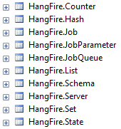

Using SQL Server
=================

.. note::

   Supported database engines: **Microsoft SQL Server 2008R2** (any edition) and later, **Microsoft SQL Azure**.

SQL Server is the default storage for HangFire – it is well known for many .NET developers and is being used in many project environments. It may be interesting that in the early stage of HangFire development, Redis was used to store information about jobs, and SQL Server storage implementation was inspired by that NoSql solution. But back to SQL Server…

SQL Server storage implementation is available through the ``HangFire.SqlServer`` NuGet package. To install it, type the following command in your NuGet Package Console window:

.. code-block:: powershell

   Install-Package HangFire.SqlServer

This package is a dependency of the HangFire's bootstrapper package ``HangFire``, so if you installed it, you don't need to install the ``HangFire.SqlServer`` separately – it was already added to your project.

Configuration
--------------

.. code-block:: c#

   app.UseSqlServerStorage("connection string or its name");

To use SQL Server as your main job storage, just pass an instance of the ``SqlServerStorage`` class to the ``JobStorage.Current`` static property with defined connection string name:

.. code-block:: c#

   JobStorage.Current = new SqlServerStorage("connection_string_name");

If you want to use full connection string, then pass it instead of a name:

.. code-block:: c#

   JobStorage.Current = new SqlServerStorage(".\\sqlexpress; Database=HangFire; Integrated Security=SSPI;");

Check the https://www.connectionstrings.com/sql-server/ site to build the correct connection string for your configuration.

Once you pass an instance of the ``SqlServerStorage`` class to the ``JobStorage.Current`` property, other things will be made automagically. If you don't like the magic as I don't like it, read the following sections to know what things is going on and how to control them.

Installing objects
~~~~~~~~~~~~~~~~~~~

HangFire leverages a couple of tables and indexes to persist background jobs and other information related to processing:

Some of these tables are used for the core functionality, others fulfill the extensibility needs (making possible to write extensions without changing the underlying schema). Advanced objects like stored procedures, triggers and so on are not being used to keep things as simple as possible and allow the library to be used with SQL Azure.

SQL Server objects are being installed automatically from the ``SqlServerStorage`` constructor by executing statements described in the ``Install.sql`` file (which is located under the ``tools`` folder in the NuGet package). Which contains the migration script, so new versions of HangFire with schema changes can be installed seamlessly, without your intervention.

If you want to install objects manually, or integrate it with your existing migration subsystem, pass your decision through the SQL Server storage options:

.. code-block:: c#

   var options = new SqlServerStorageOptions
   {
       PrepareSchemaIfNecessary = false
   };

   var storage = new SqlServerStorage("<name or connection string>", options);

Configuring the Polling Interval
~~~~~~~~~~~~~~~~~~~~~~~~~~~~~~~~~

One of the main disadvantage of raw SQL Server job storage implementation – it uses the polling technique to fetch new jobs. You can adjust the polling interval, but, as always, lower intervals can harm your SQL Server, and higher interval produce too much latency, so be careful. 

.. code-block:: c#

   var options = new SqlServerStorageOptions
   {
       QueuePollInterval = TimeSpan.FromSeconds(15) // Default value
   };

   var storage = new SqlServerStorage("<name or connection string>", options);

If you want to remove the polling technique, consider using the MSMQ extensions or Redis storage implementation.

Configuring the Invisibility Timeout
~~~~~~~~~~~~~~~~~~~~~~~~~~~~~~~~~~~~~

Default SQL Server job storage implementation uses a regular table as a job queue. To be sure that a job will not be lost in case of unexpected process termination, it is being deleted only from a queue only upon a successful completion. 

To make it invisible from other workers, the ``UPDATE`` statement with ``OUTPUT`` clause is being used to fetch a queued job and update the ``FetchedAt`` value (that signals for other workers that it was fetched) in an atomic way. Other workers see the fetched timestamp and ignore a job. But to handle the process termination, they will ignore a job only during a specified amount of time (defaults to 30 minutes).

Although this mechanism ensures that every job will be processed, sometimes it may cause either long retry latency or lead to multiple job execution. Consider the following scenario:

1. Worker A fetched a job (runs for a hour) and started it at 12:00.
2. Worker B fetched the same job at 12:30, because the default invisibility timeout was expired.
3. Worker C fetched the same job at 13:00, because 

If you are using :doc:`cancellation tokens <../background-methods/using-cancellation-tokens>`, it will be set for Worker A at 12:30, and at 13:00 for Worker B. This may lead to the fact that your long-running job will never be executed. If you aren't using cancellation tokens, it will be concurrently executed by WorkerA and Worker B (since 12:30), but Worker C will not fetch it, because it will be deleted after successful performance.

So, if you have long-running jobs, it is better to configure the invisibility timeout interval:

.. code-block:: c#

   var options = new SqlServerStorageOptions
   {
       InvisibilityTimeout = TimeSpan.FromMinutes(30) // default value
   };

   var storage = new SqlServerStorage("<name or connection string>", options);

If you want to forget about invisibility interval, take a look at MSMQ extension, it uses transactional queues that return a job to its queue immediately upon a process termination.